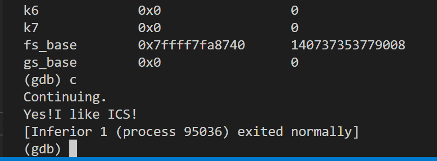

# 栈溢出攻击实验

## 题目解决思路

### Problem 1:

- **分析**：

  通过对 `problem1` 二进制文件的反汇编分析，发现漏洞存在于 `func` 函数中：

  1.  **漏洞函数**：`func` 函数调用了不安全的 `strcpy` 函数。
  2.  **栈帧结构分析**：
      - 在 `func` 中，汇编代码 `40123a: sub $0x20, %rsp` 为局部变量分配了空间。
      - 缓冲区 `s` 的起始地址通过 `401246: lea -0x8(%rbp), %rax` 确定，这意味着缓冲区 `s` 距离 `rbp` 只有 8 个字节。
      - 在标准的 x86-64 栈帧中，`rbp` 指向的位置存储着 Saved RBP（8 字节），而紧随其后的 `rbp + 8` 处存储的是 **返回地址 (Return Address)**。
  3.  **攻击路径**：
      - 由于 `strcpy` 不检查输入长度，我们可以通过 `ans1.txt` 提供一个长字符串。
      - 该字符串将首先填满 8 字节的缓冲区，接着覆盖 8 字节的 Saved RBP，最后精准覆盖原本应返回 `main` 函数的返回地址。
  4.  **攻击目标**：
      - 通过查看反汇编，发现一个隐藏函数 `func1`，其起始地址为 `0x401216`。
      - 目标是劫持程序流，使其跳转到 `func1` 执行并输出成功信息。

  

- **解决方案**：Payload 构造逻辑

  Payload 的组成部分如下：

  - **填充数据 (Padding)**：16 个字节的无关字符，用于填满局部变量空间（8 字节）和覆盖 Saved RBP（8 字节）。
  - **目标地址 (Target Address)**：8 个字节的目标函数地址 `0x401216`。由于 x86-64 使用小端序存储，地址应表示为：`\x16\x12\x40\x00\x00\x00\x00\x00`。

  **生成 Payload 的 Python 代码**

  ```python
    padding = b"A" * 16
    func1_address = b"\x16\x12\x40\x00\x00\x00\x00\x00"  # 小端地址
    payload = padding+ func1_address
  ```

  **攻击结果证明**

  在 GDB 中运行 `run ans1.txt` 后，程序执行流被成功劫持：

  - **GDB 断点表现**：当程序运行到 `func` 的 `ret` 指令（`0x401257`）时，栈顶元素已变为 `0x401216`。
  - **输出结果**：程序绕过了 `main` 函数后续逻辑，直接进入 `func1` 并打印了：
    ```text
    Yes! I like ICS!
    ```
  - **退出状态**：由于 `func1` 内部调用了 `exit(0)`，程序显示 `exited normally`。

- **结果**：



### Problem 2:

- **分析**：...
- **解决方案**：payload 是什么，即你的 python 代码 or 其他能体现你 payload 信息的代码/图片
- **结果**：附上图片

### Problem 3:

- **分析**：...
- **解决方案**：payload 是什么，即你的 python 代码 or 其他能体现你 payload 信息的代码/图片
- **结果**：附上图片

### Problem 4:

- **分析**：体现 canary 的保护机制是什么
- **解决方案**：payload 是什么，即你的 python 代码 or 其他能体现你 payload 信息的代码/图片
- **结果**：附上图片

## 思考与总结

## 参考资料

列出在准备报告过程中参考的所有文献、网站或其他资源，确保引用格式正确。
