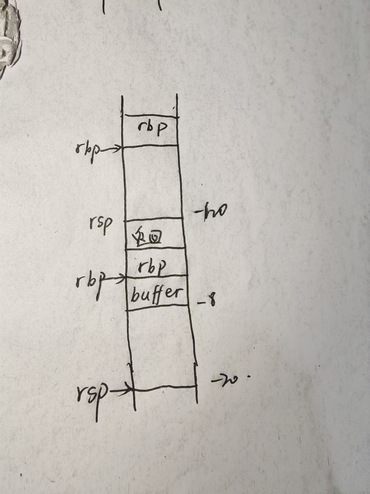
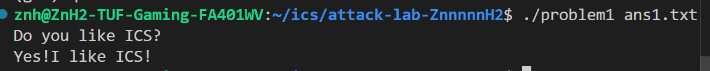
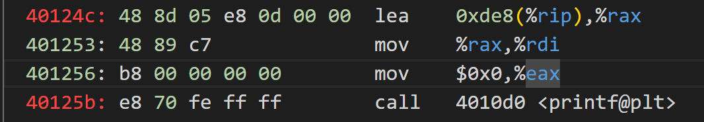
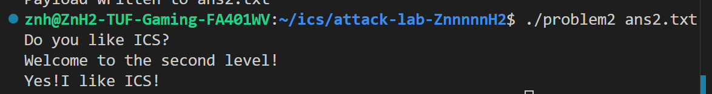
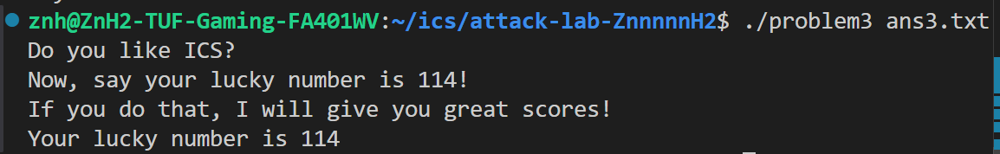
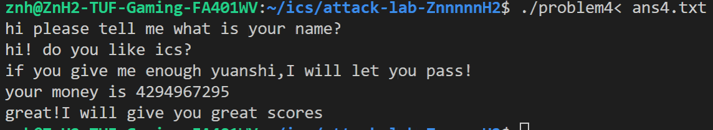

# 栈溢出攻击实验

## 题目解决思路

### Problem 1

#### 1. 分析

通过对 `problem1` 二进制文件的反汇编分析，发现漏洞存在于 `func` 函数中：

1.  **漏洞函数**：`func` 函数调用了不安全的 `strcpy` 函数。
2.  **栈帧结构分析**：
    - 在 `func` 中，汇编代码 `40123a: sub $0x20, %rsp` 为局部变量分配了空间。
    - 缓冲区 `s` 的起始地址通过 `401246: lea -0x8(%rbp), %rax` 确定，这意味着缓冲区 `s` 距离 `rbp` 只有 8 个字节。
    - 在标准的 x86-64 栈帧中，`rbp` 指向的位置存储着 Saved RBP（8 字节），而紧随其后的 `rbp + 8` 处存储的是返回地址。
3.  **攻击路径**：
    - 由于 `strcpy` 不检查输入长度，我们可以通过 `ans1.txt` 提供一个长字符串。
    - 该字符串将首先填满 8 字节的缓冲区，接着覆盖 8 字节的 Saved RBP，最后精准覆盖原本应返回 `main` 函数的返回地址。
4.  **攻击目标**：
    - 通过查看反汇编，发现一个隐藏函数 `func1`，其起始地址为 `0x401216`。
    - 目标是劫持程序流，使其跳转到 `func1` 执行并输出成功信息。



#### 2. 解决方案

Payload 的组成部分如下：

- **填充数据 (Padding)**：16 个字节的无关字符，用于填满局部变量空间（8 字节）和覆盖 Saved RBP（8 字节）。
- **目标地址 (Target Address)**：8 个字节的目标函数地址 `0x401216`。由于 x86-64 使用小端序存储，地址应表示为：`\x16\x12\x40\x00\x00\x00\x00\x00`。

**生成 Payload 的 Python 代码**

```python
padding = b"A" * 16
func1_address = b"\x16\x12\x40\x00\x00\x00\x00\x00"  # 小端地址
payload = padding + func1_address
```

**攻击结果证明**

在 GDB 中运行 `run ans1.txt` 后，程序执行流被成功劫持：

- **GDB 断点表现**：当程序运行到 `func` 的 `ret` 指令（`0x401257`）时，栈顶元素已变为 `0x401216`。
- **输出结果**：程序绕过了 `main` 函数后续逻辑，直接进入 `func1` 并打印了：
  ```text
  Yes! I like ICS!
  ```

#### 3. 结果



### Problem 2

#### 1. 分析

同上题类似，只不过现在目标函数 `func2` 会校验变量 `x` 的值是否为 1016。但 `x` 储存在栈上的位置距离 buffer 太远，`memcpy` 函数限制了拷贝长度，无法通过简单的栈溢出覆盖到 `x` 的值。

尝试直接跳转到 `func2` 输出 `Yes! I like ICS!` 的位置。也就是下图的 `0x40124c` 处。



#### 2. 解决方案

```python
padding = b"A" * 16
func2_address = b"\x4c\x12\x40\x00\x00\x00\x00\x00"  # 小端地址
payload = padding + func2_address
```

#### 3. 结果



### Problem 3

#### 1. 分析

- 本方法在开启栈地址随机化时仍有效。整体思路和 Problem 2 相似。通过汇编可以看到 `func` 函数中分配了 32 字节的局部变量空间，可以通过覆盖 buffer 来覆盖返回地址。目标是跳转到 `func1` 函数。
- 由于栈返回时 `leave` 指令会从栈顶弹出一个值，存入 `%rbp` 寄存器。但与之前不同的是，Problem 3 的 `func1` 函数会使用栈上的变量，因此需要保证 `%rbp` 指向一个合法的栈空间，否则 `func1` 函数会因为访问非法内存而崩溃。因此在覆盖返回地址时，需要在返回地址前面填充一个合法的（该地址所在页是可写的而且没有重要数据）`rbp` 值。
- 通过 `info proc mappings` 可以看到 `0x403000 - 0x404000` 这一页是可读写的，因此可以选择一个该页内的地址作为 `rbp` 值，比如 `0x403800`。

#### 2. 解决方案

```python
padding = b"A" * 32
rbp = b"\x00\x38\x40\x00\x00\x00\x00\x00"
func1_address = b"\x2b\x12\x40\x00\x00\x00\x00\x00"  # 小端地址
payload = padding + rbp + func1_address
```

#### 3. 结果



### Problem 4

#### 1. 分析

**Canary 机制**：程序在函数序言中将一个随机值（Canary，来自 `%fs:0x28`）放置在栈帧的返回地址之前（`%rbp-0x8`），并在函数返回前校验该值。如果使用溢出手段覆盖返回地址，必然会破坏 Canary，导致程序调用 `__stack_chk_fail` 并终止。

汇编代码分析如下：

1.  **插入 Canary**：
    在函数序言部分，程序从 `%fs:0x28` 读取随机的 Canary 值并存入栈中。

    ```assembly
    136c: 64 48 8b 04 25 28 00 00 00 	mov    %fs:0x28,%rax
    1375: 48 89 45 f8                	mov    %rax,-0x8(%rbp)
    ```

    这里将 Canary 存放在了 `%rbp - 8` 的位置，紧邻 Saved RBP 和返回地址。

2.  **检查 Canary**：
    在函数准备返回前，程序会读取栈上的 Canary 值并与 `%fs:0x28` 中的原值进行比较：
    ```assembly
    140a: 48 8b 45 f8                	mov    -0x8(%rbp),%rax
    140e: 64 48 2b 04 25 28 00 00 00 	sub    %fs:0x28,%rax
    1417: 74 05                      	je     141e <func+0xc1>
    1419: e8 b2 fc ff ff             	call   10d0 <__stack_chk_fail@plt>
    ```
    如果栈上的 Canary 值被修改（例如被缓冲区溢出覆盖），`je` 跳转不执行，程序调用 `__stack_chk_fail` 报错退出。这也是为什么虽然 `main` 函数中存在 `scanf` 字符串输入可能导致溢出，但无法简单利用溢出来劫持程序流的原因。

代码中使用 Canary 保护的函数，在汇编中均可找到上述代码：

1. `caesar_decrypt`
2. `func1`
3. `func`
4. `main`

通过分析 `func` 函数的逻辑，程序接收一个整数输入，并执行一个极长的循环（计数到 `0xfffffffe`）。要让程序调用打印成功信息的 `func1`，输入值需满足特定条件。
经分析，当输入为 `-1`（即 `0xffffffff`）时：

1.  能够绕过初步的大小检查（`unsigned` 比较）。
2.  经过循环递减后，变量值变为 `1`，满足最终的校验条件，从而进入成功分支。

#### 2. 解决方案

无需利用漏洞。程序运行时，前两个问题输入任意字符串，第三个问题输入 `-1` 即可。

**Payload**:

```text
aaa
aaa
-1
```

#### 3. 结果



## 思考与总结

非常好的 lab 使我的汇编旋转。

## 参考资料

- CSAPP
